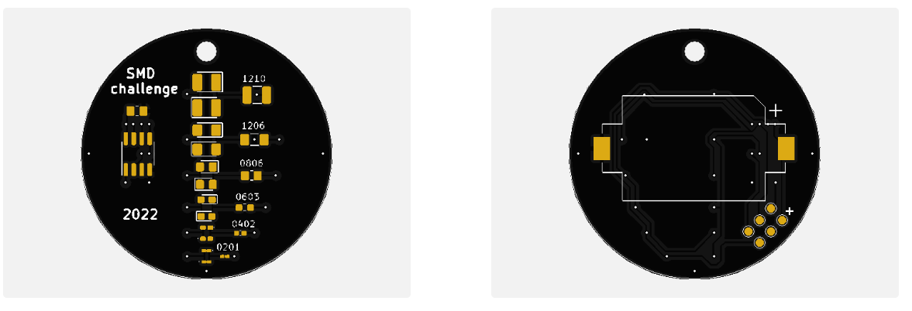
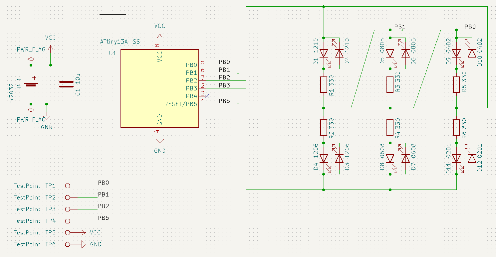
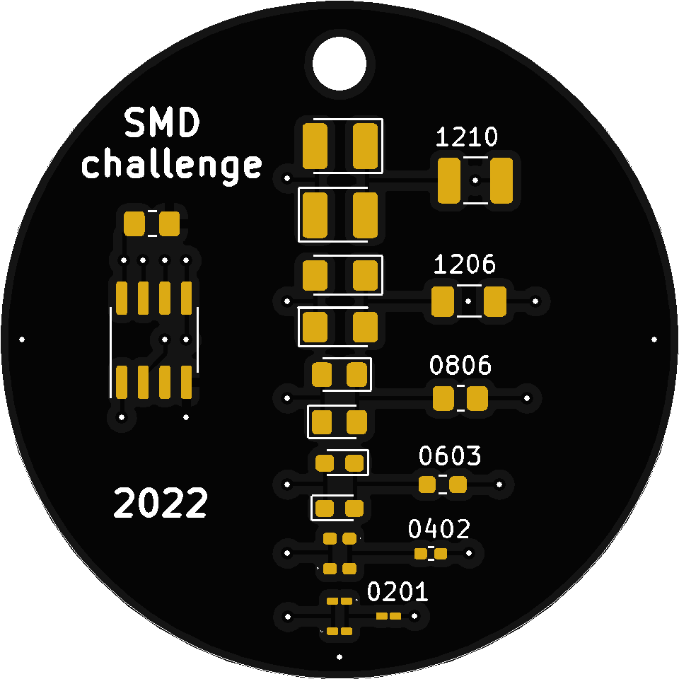
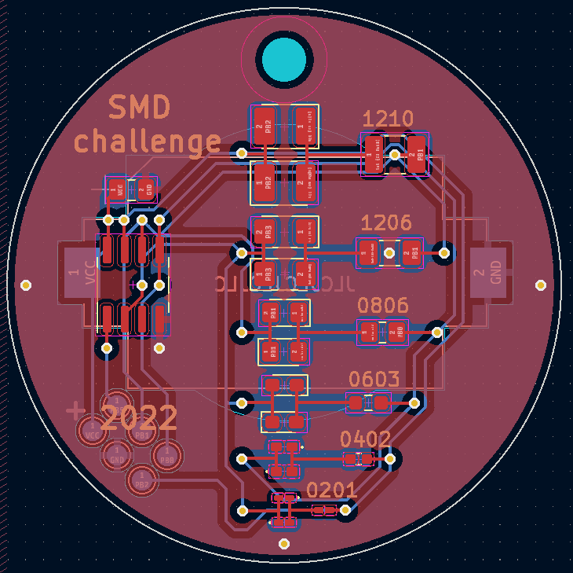

# SMD soldering challenge

https://user-images.githubusercontent.com/78444256/188329124-fbfda367-b1dc-41d7-a8d5-ee6e349dee65.mp4

This project is about hand-soldering tiny SMD components onto a PCB. Similar to [Defcon](https://dchhv.org/events/smdsolderchallenge.html) in [2018](https://hackaday.com/2018/08/02/smd-soldering-challenge-lands-at-def-con/).

My goals:
- I wanna try! (both with and without extra tools).
  In the past, I've done some PCB development, debugging, soldering and measuring around 2008 for developing digital cameras, with large FPGAs (Xilinx Vertex), my own DDR memory controller on complex 10+ layer PCBs. Back then, this was no 0201 and I'm much older now with many years of just Matlab coding and only little electronics. 
  

- I don't think that I will succeed on the first try.
  I will need more than one shot with the tiny components, especially towards 0201. 
  the kit from the set above comes with one component each - this might not be enough.

- Learn some more! 
  The new Kicad 6 looks realy good and I'm lacking practice in PCB design, this looks like a good chance for a quick project with focus on aesthetics.   
  I've not worked wit Atmel microcontrollers for over 15 years - time to refresh.
  
- Maybe this is for sharing?
  In the last years, I met a few electronics developers who might like to be gifted a kit. I'm certainly not going to order just one set.
  
  
  
  
Status:
- PCBs have arrived, assembled and code is working

Errata: 
- silkscreen says "0806", should be "0805"

# Schematic and PCB

changes I made (on purpose)
- two LEDs per type, flip one other than the first, and everything will light up
- all LEDs in the center, I'm looking for an icicle christmas decoration effect of dropping light
- all LEDs wired to the controller, should be ably to drive one at a time, in any orientation

# Components

I put together a list of components I ordered from LCSC:

Resistors  (package, value, number of pieces I ordered, description):
- 0201 R 330Ohm    500  UNI-ROYAL(Uniroyal Elec) 0201WMF3300TEE   [LCSC Part # C516485](https://lcsc.com/product-detail/Chip-Resistor-Surface-Mount_UNI-ROYAL-Uniroyal-Elec-0201WMF3300TEE_C516485.html)
- 0201 R 330Ohm    500  Walsin Tech Corp WR02X3300FTL       [LCSC Part # C367585](https://lcsc.com/product-detail/Chip-Resistor-Surface-Mount_Walsin-Tech-Corp-WR02X3300FTL_C367585.html)
- 0402 R 330Ohm    300  FOJAN FRC0402F3300TS                [LCSC Part # C2930002](https://lcsc.com/product-detail/Chip-Resistor-Surface-Mount_FOJAN-FRC0402F3300TS_C2930002.html)
- 0603 R 330Ohm    300  FOJAN FRC0603F3300TS                [LCSC Part # C2933198](https://lcsc.com/product-detail/Chip-Resistor-Surface-Mount_FOJAN-FRC0603F3300TS_C2933198.html)
- 0803 R 330Ohm    300  FOJAN FRC0805F3300TS                [LCSC Part # C2930157](https://lcsc.com/product-detail/Chip-Resistor-Surface-Mount_FOJAN-FRC0805F3300TS_C2930157.html)
- 1206 R 330Ohm    300  FOJAN FRC1206F3300TS                [LCSC Part # C2933675](https://lcsc.com/product-detail/Chip-Resistor-Surface-Mount_FOJAN-FRC1206F3300TS_C2933675.html)
- 1210 R 330Ohm    150  FOJAN FRC1210F3300TS                [LCSC Part # C2933817](https://lcsc.com/product-detail/Chip-Resistor-Surface-Mount_FOJAN-FRC1210F3300TS_C2933817.html)

LEDs (package, value, number of pieces I ordered, description):
- 0201 LED red   150   XINGLIGHT XL-0201SURC        [LCSC Part # C3646923](https://lcsc.com/product-detail/Light-Emitting-Diodes-LED_XINGLIGHT-XL-0201SURC_C3646923.html)
- 0402 LED red   100   XINGLIGHT XL-1005SURC        [LCSC Part # C965790](https://lcsc.com/product-detail/Light-Emitting-Diodes-LED_XINGLIGHT-XL-1005SURC_C965790.html)
- 0603 LED red   100   XINGLIGHT XL-1608SURC-06     [LCSC Part # C965799](https://lcsc.com/product-detail/Light-Emitting-Diodes-LED_XINGLIGHT-XL-1608SURC-06_C965799.html)
- 0805 LED red   100   XINGLIGHT XL-2012SURC        [LCSC Part # C965812](https://lcsc.com/product-detail/Light-Emitting-Diodes-LED_XINGLIGHT-XL-2012SURC_C965812.html)
- 1206 LED red   100   TUOZHAN P2-1206RTCS2-0.9T-F  [LCSC Part # C2827254](https://lcsc.com/product-detail/Light-Emitting-Diodes-LED_TUOZHAN-P2-1206RTCS2-0-9T-F_C2827254.html)
- 1210 LED red   100   XINGLIGHT XL-3227SURUGC      [LCSC Part # C965842](https://lcsc.com/product-detail/Light-Emitting-Diodes-LED_XINGLIGHT-XL-3227SURUGC_C965842.html)

Others
- 0603 C 10uF10V  100    Samsung Electro-Mechanics CL10A106KP8NNNC  [LCSC Part # C19702](https://lcsc.com/product-detail/Multilayer-Ceramic-Capacitors-MLCC-SMD-SMT_Samsung-Electro-Mechanics-CL10A106KP8NNNC_C19702.html)
- SIOC-8 150mil  15x    Microchip Tech ATTINY13A-SSU   [LCSC Part # C14075](https://lcsc.com/product-detail/ATMEL-AVR_Microchip-Tech-ATTINY13A-SSU_C14075.html)
- Batt    15x   Q&J CR2032-BS-6-1   [LCSC Part # C70377](https://lcsc.com/product-detail/Battery-Connectors_Q-J-CR2032-BS-6-1_C70377.html)

# Results

I packed a few kits with a programmed Attiny13 already on the board. I'm waiting for assembly feedback.

# Power consumption
measured with 3V supply and 12Ohm resistor
- 12x LED flash of 5msec, 42mV -> 3.5mA, energy of 17.5 mA msec
- 12x pause between flashes 375msec, <0.01mA, energy of 3.75 mA msec
- long pause 1.5sec, <0.01mA, energy of 15 mA msec

Total of 6060msec and energy of 270 mA msec, average current of 0.045mA
In theory, a CR2032 coin cell with 120mAh could last >100 days - let's see.

